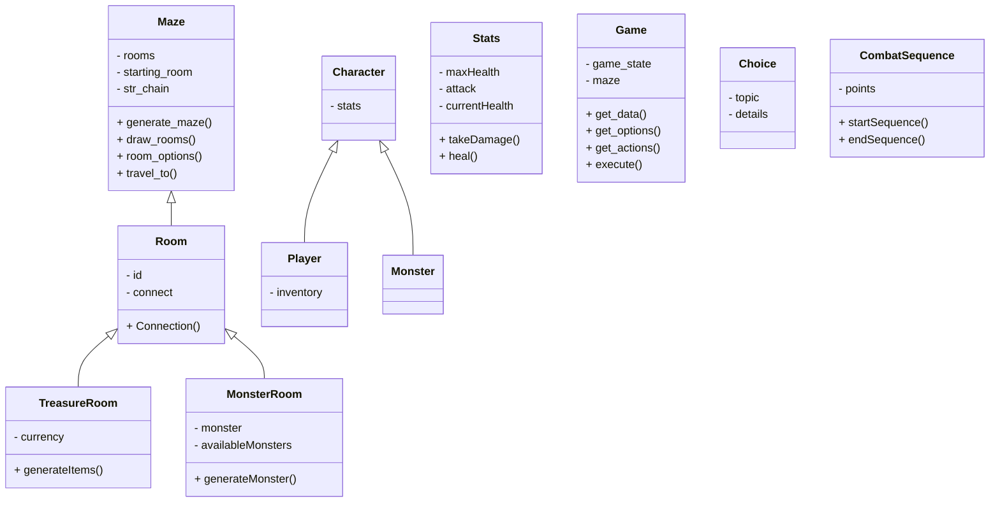

# 2025-summary-project

## Members

- Marcos
- Jacob
- Savio
- Yufan
- Vince

# This is a J1 Summary Project
- It is a simple MUD game about ...

```mermaid
classDiagram
    Maze <|-- Room
    
    Maze : - rooms
    Maze : - starting_room
    Maze : - str_chain

    Room : - id
    Room : - connect
    Room <|-- TreasureRoom
    Room <|-- MonsterRoom

    TreasureRoom : - currency
    MonsterRoom : - monster
    MonsterRoom : - availableMonsters

    Character : - stats
    Character <|-- Player
    Character <|-- Monster
    Player : - inventory

    Stats : - maxHealth
    Stats : - attack
    Stats : - currentHealth

    Game : - game_state
    Game : - maze

    Choice : - topic
    Choice : - details

    CombatSequence : - points
    class Room{
        + Connection()
    }
    class Maze{
        + generate_maze()
        + draw_rooms()
        + room_options()
        + travel_to()
    }
    class Game{
        + get_data()
        + get_options()
        + get_actions()
        + execute()
    }
    class TreasureRoom{
        + generateItems()
    }

    class MonsterRoom{
        + generateMonster()
    }
    
    class Stats{
        + takeDamage()
        + heal()
    }
    
    class CombatSequence{
        + startSequence()
        + endSequence()
    }
```